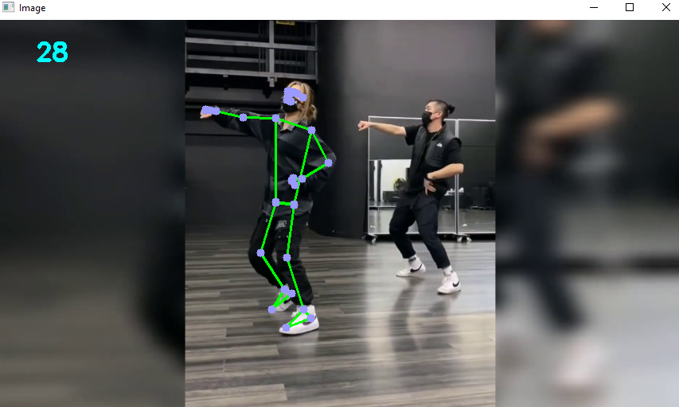
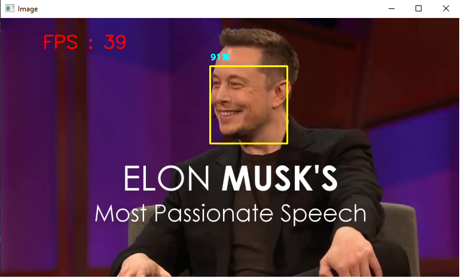

# AdvancedComputerVision
Hand Tracking, Pose Estimation, Face Detection and Face Mesh basics and module projects are included in this repository. Also, there will be related projects based on these modules
The modules are created to use the basics of the project in another project. The detection operation are done by using mediapipe and opencv library in Python

  
  
  
  

